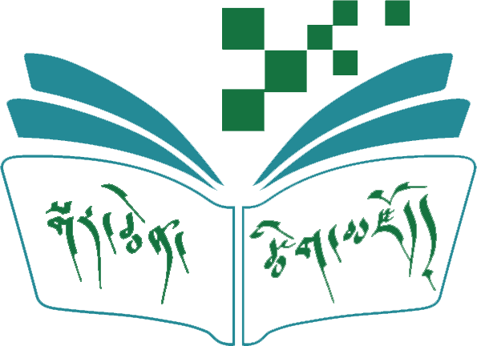
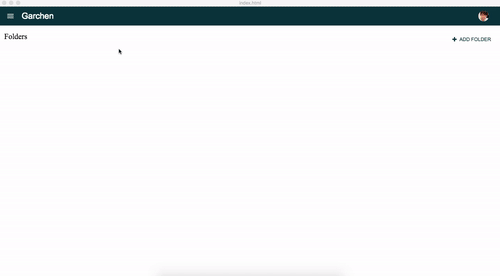

# Garchen Panel
> Multi-language dictionary creation tool

[](https://travis-ci.org/karmapa17/garchen-panel)
[](https://coveralls.io/github/karmapa17/garchen-panel?branch=master)
[](https://david-dm.org/karmapa17/garchen-panel)



## Contents
- [User Story](https://goo.gl/s7u0Sd)
- [Usage](#usage)

## Usage

### Installation
```console
yarn
```
### Developing
```console
yarn dev
```
### Building production desktop applications (Windows / iOS)
This command will create a folder named zip contains windows and iOS platform zip files
```console
yarn build
```
## License
MIT © [Dharma Treasure](https://dharma-treasure.org)
